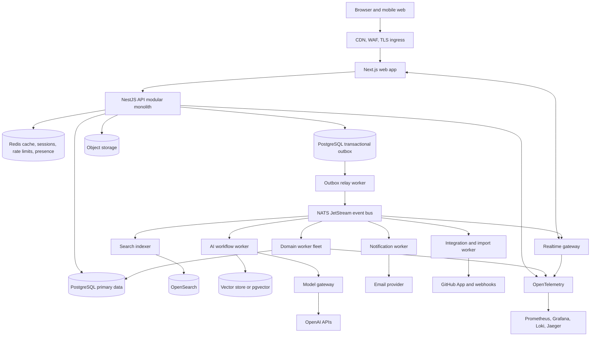

# Overview And Initial Architecture

Last updated: 2026-05-15

Status: Proposed Phase 1 baseline

Back to [System Architecture](README.md).

## Executive Decision

Qeetro Phase 1 should start as a **hybrid modular monolith**: one product and domain codebase with strict bounded contexts, backed by PostgreSQL, a transactional outbox, event-driven workers, a separately scalable realtime gateway, and separately scalable background workers for search, imports, integrations, notifications, and AI.

This is the right starting point because Phase 1 is constrained by product coherence, tenant safety, speed of execution, and trust foundations. It is not yet constrained by independent service scale. Microservices should be extracted only after module boundaries, traffic patterns, operational ownership, and tenant isolation rules are proven in production.

The initial architecture has five runtime surfaces:

| Runtime          | Purpose                                                                         | Scaling Axis                             |
| ---------------- | ------------------------------------------------------------------------------- | ---------------------------------------- |
| Next.js web app  | Product shell, issue views, docs, search, AI review surfaces                    | Web traffic and edge cache behavior      |
| NestJS API       | Auth, commands, queries, RBAC, domain transactions, REST and GraphQL            | API request volume and tenant hot spots  |
| Worker fleet     | Outbox relay, notifications, email, imports, GitHub webhooks, indexing, AI jobs | Queue depth, event lag, provider latency |
| Realtime gateway | WebSocket subscriptions, tenant-scoped fanout, revocation signals               | Concurrent connections and event fanout  |
| Scheduler        | Expiration, retries, digest-ready jobs, reindex requests, cleanup               | Timed job volume and reliability         |

The architecture must preserve these extraction paths from day one:

1. Realtime gateway can become an independent service as connection count grows.
2. Integration and import workers can become an independent integration service.
3. Search indexing and retrieval can become an independent search service.
4. AI orchestration can become an independent AI platform service.
5. Notifications can become an independent delivery service.
6. Identity, tenancy, and execution core should remain together until product and scale force separation.

## Architecture Goals

Phase 1 architecture must optimize for:

- Fast product iteration without weak domain boundaries.
- Tenant isolation across API, database, cache, events, search, vector retrieval, logs, analytics, realtime, jobs, imports, integrations, and AI.
- Permission-aware retrieval and source-backed AI from the beginning.
- Realtime collaboration that degrades to durable state refetch.
- Event-driven background work with retry safety, dead-letter handling, and replay paths.
- Enterprise-ready audit, actor attribution, RBAC, observability, and secrets handling.
- Clear service extraction paths without premature network boundaries.

Phase 1 must not optimize for:

- A full microservice platform before product fit.
- Arbitrary workflow customization.
- A broad automation marketplace.
- Autonomous AI actions without approval boundaries.
- Multi-region active-active deployment.
- Enterprise policy surfaces that slow daily execution.

## High-Level System Topology

## Initial Architecture Strategy

### Decision

Use a **modular monolith with extracted runtime workers**, not independent microservices for every domain.

The backend should be a NestJS application organized by domain modules. Each module owns its data access layer, command handlers, query handlers, domain events, integration contracts, and tests. Modules may share infrastructure packages for database access, observability, authorization primitives, event publishing, and validation, but domain modules must not reach into each other's tables or private repositories.

### Why This Is The Right Phase 1 Tradeoff

| Concern          | Modular Monolith Answer                      | Microservices Risk In Phase 1                          |
| ---------------- | -------------------------------------------- | ------------------------------------------------------ |
| Product speed    | Single deployment and easier refactors       | Cross-service contracts slow early learning            |
| Domain clarity   | Bounded contexts enforced in code            | Weak boundaries become network calls without ownership |
| Tenant safety    | One authorization model and request context  | Inconsistent tenant checks across services             |
| Reliability      | Fewer network dependencies on critical paths | Retry storms and partial failures arrive early         |
| Operational load | Small team can operate the platform          | Too many deployables, dashboards, and runbooks         |
| Future scale     | Workers and gateways extract cleanly         | Premature service boundaries may be wrong              |

### Runtime Separation Without Domain Fragmentation

The monolith should build multiple deployable processes from shared packages:

- `web`: Next.js application.
- `api`: NestJS HTTP, REST, GraphQL, commands, and queries.
- `worker`: async domain workers and event consumers.
- `realtime`: WebSocket gateway and subscription authorizer.
- `scheduler`: delayed and recurring jobs.

This gives Qeetro operational scaling where it matters while preserving early domain coherence.
