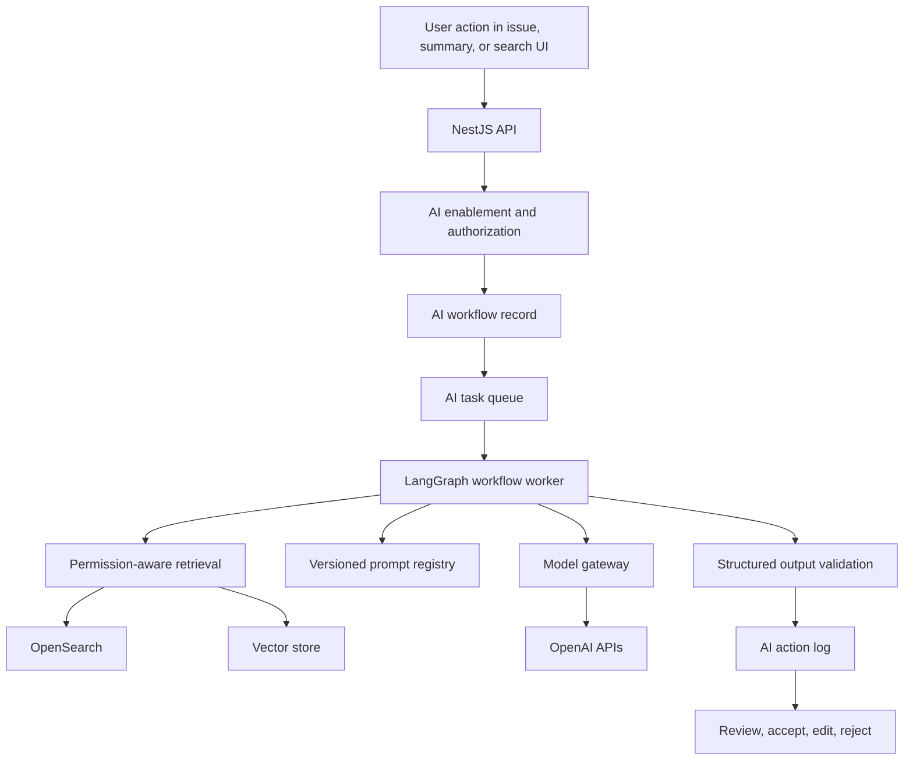
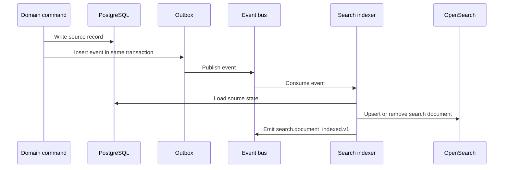

# Realtime, AI, And Search

Last updated: 2026-05-15

Status: Proposed Phase 1 baseline

Back to [System Architecture](README.md).

## Realtime Architecture

Realtime is a primitive, but durable state remains authoritative.

### Components

| Component            | Responsibility                                                           |
| -------------------- | ------------------------------------------------------------------------ |
| Realtime gateway     | WebSocket authentication, subscription management, channel authorization |
| Redis adapter        | Cross-pod fanout, ephemeral presence, connection metadata                |
| Event consumer       | Converts domain events into realtime patches or refetch signals          |
| Subscription revoker | Invalidates channels after membership, role, or access changes           |
| Client cache layer   | React Query receives patches or invalidates queries                      |

### Channel Model

Channels should be logical and tenant-scoped:

```text
org:{organizationId}:user:{userId}:notifications
org:{organizationId}:workspace:{workspaceId}:shell
org:{organizationId}:workspace:{workspaceId}:members
org:{organizationId}:workspace:{workspaceId}:project:{projectId}
org:{organizationId}:workspace:{workspaceId}:issue:{issueId}
org:{organizationId}:workspace:{workspaceId}:import:{importRunId}
org:{organizationId}:workspace:{workspaceId}:ai:{workflowId}
```

Clients should not depend on raw channel names as public API. The server authorizes subscription requests and maps them internally.

### Realtime Payload Types

| Type           | Use                                        | Example                                          |
| -------------- | ------------------------------------------ | ------------------------------------------------ |
| Patch          | Small safe state update                    | Issue status changed, notification read          |
| Refetch signal | State may be large or permission-sensitive | Board reorder, membership change, search update  |
| Revocation     | Access reduced or removed                  | Workspace removed, role changed, session revoked |

### Safety Rules

- Authenticate every connection.
- Authorize every subscription.
- Revalidate permissions on reconnect.
- Revalidate subscriptions when membership or role changes.
- Removed users stop receiving workspace, issue, doc, search, and AI workflow events.
- Realtime payloads must contain only data the recipient can access.
- Clients reconcile against durable API state after reconnect, missed sequence, or permission change.

### Presence

Presence should be a Phase 1 foundation only. Store ephemeral presence in Redis with TTL. Do not make presence a source of truth or an analytics surface for individual productivity scoring.

## AI Platform Architecture

AI in Phase 1 is governed assistance, not autonomous execution.

### AI Runtime Topology



### AI Platform Components

| Component                  | Responsibility                                                                        |
| -------------------------- | ------------------------------------------------------------------------------------- |
| AI settings                | Organization and workspace AI enablement, data-use placeholder, approval defaults     |
| Model gateway              | Provider abstraction, timeout policy, retries, fallback, token and cost-ready metrics |
| Prompt registry            | Versioned prompts, structured output schemas, rollout control                         |
| Retrieval service          | Permission-aware retrieval from search and vector projections                         |
| AI workflow worker         | Issue draft, refinement, summary, workspace Q&A orchestration                         |
| AI action log              | Actor, target, sources, output state, approval state, model metadata                  |
| Evaluation harness         | Fixtures for drafts, summaries, no-answer search, hallucination rejection             |
| Agent identity placeholder | Future agent profile with owner, purpose, scope, lifecycle, autonomy level            |

### AI Workflows In Phase 1

| Workflow         | Inputs                                               | Output                                                                    | Approval Boundary                      |
| ---------------- | ---------------------------------------------------- | ------------------------------------------------------------------------- | -------------------------------------- |
| Issue draft      | User prompt, selected docs/comments, project context | Suggested title, description, labels, type, priority, acceptance criteria | User must review before issue creation |
| Issue refinement | Existing issue and permitted context                 | Suggested edits                                                           | User must accept edits                 |
| Work summary     | Issue, project, sprint, or thread context            | Source-backed summary                                                     | No mutation by default                 |
| Workspace Q&A    | Natural language query                               | Answer with sources or no-answer response                                 | No mutation                            |

### Permission-Aware Retrieval

Retrieval must execute as the requesting actor, not as a superuser.

Required retrieval filters:

- Organization ID.
- Workspace IDs the actor can access.
- Resource type and lifecycle state.
- Project or issue access scope when future project sharing exists.
- Source IDs visible to the actor.
- Archive/deletion visibility policy.

Retrieval source classes:

- Projects.
- Issues and issue history summaries.
- Comments.
- Docs.
- Sprint/cycle metadata and summaries.
- GitHub PR and commit link metadata.
- Import summaries where visible.

Do not include raw secrets, invite tokens, session data, credentials, hidden resources, or unsupported external content in prompts.

### Vector Store Strategy

Use an abstraction called `VectorStore` in Phase 1. The first implementation can be pgvector or OpenSearch vector search to reduce operational surface area. A dedicated vector database can be introduced later when embedding volume, recall requirements, or isolation needs justify it.

Embedding metadata must include:

```text
organization_id
workspace_id
source_type
source_id
project_id
issue_id
lifecycle_state
permission_scope_hash
content_hash
embedding_model
created_at
updated_at
```

### AI Auditability

Every meaningful AI workflow writes an AI action log with:

- Event ID.
- Organization ID.
- Workspace ID.
- Actor ID and actor type.
- Workflow type.
- Target type and target ID.
- Source references.
- Prompt template and version.
- Output state: generated, accepted, edited, rejected, failed.
- Approval state.
- Safe model metadata.
- Latency and cost-ready metadata.
- Correlation ID.

AI action logs are not a replacement for audit events. Sensitive AI setting changes and future high-impact AI actions must also write audit events.

## Search And Indexing Architecture

### Search Store

Use OpenSearch for Phase 1 full-text and filtered search. Keep the index derived and rebuildable.

Recommended index model:

- One logical multi-entity workspace search index per environment, versioned through aliases.
- Documents include `organization_id`, `workspace_id`, `source_type`, `source_id`, title, body excerpt, labels, status, timestamps, lifecycle state, and permission metadata.
- Separate index aliases for current and rebuild versions, for example `qeetro-search-v1-current`.
- Reindex jobs read from PostgreSQL source records and write through bulk indexing.

### Indexing Flow



### Search Permission Rules

- Query filters must be built from the actor's effective organization, workspace, and resource access.
- Search results must not reveal hidden resource titles or counts.
- Removed users must lose search access immediately where possible and at minimum on next permission refresh.
- Permission changes trigger cache invalidation and, where needed, permission metadata refresh.
- Search index freshness must be observable.

### Reindex And Backfill

Reindexing must support:

- Full workspace reindex.
- Entity type reindex.
- Single source ID reindex.
- Permission metadata refresh.
- Failed document retry.
- Blue-green index rebuild with alias switch.
