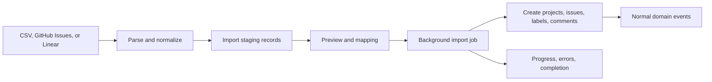

# Notifications, Integrations, And Imports

Last updated: 2026-05-15

Status: Proposed Phase 1 baseline

Back to [System Architecture](README.md).

## Notification Architecture

Notifications are durable records first, delivery attempts second.

| Concept                 | Purpose                                                   |
| ----------------------- | --------------------------------------------------------- |
| Notification record     | In-app source of truth and read/unread state              |
| Notification preference | User and workspace preference foundation                  |
| Delivery attempt        | Email or future external channel attempt with retry state |
| Eligibility check       | Current permission and membership verification            |

### Phase 1 Notification Types

- Invite email.
- Invite accepted.
- Role changed.
- Member removed.
- Mention created.
- Issue assigned.
- Comment activity where high signal.
- Import completed or failed.
- GitHub link created where useful.
- AI workflow completed or failed where the user initiated it.

### Delivery Rules

- Create in-app notification records for eligible users.
- Email is required for invites and optional for high-signal events.
- Re-check eligibility before external delivery.
- Stop delivery immediately after organization or workspace removal.
- Use idempotency keys for fanout, especially mentions and assignments.
- Track delivery failures and retry with backoff.

## Integration And Import Architecture

### GitHub Integration

Use a GitHub App for Phase 1 rather than a broad OAuth token model.

Rationale:

- Installation scopes are explicit.
- Webhooks are first-class.
- Repository permissions can be narrower.
- App identity maps cleanly to a service actor.

Core records:

```text
integration_connections
integration_credentials
integration_actors
external_repository_links
issue_external_links
webhook_deliveries
```

Security rules:

- Verify webhook signature.
- Resolve installation to Qeetro integration connection.
- Validate organization and workspace scope before processing.
- Store credentials only in a secret store or encrypted credential service.
- Store only credential references in PostgreSQL.
- Never log provider tokens, webhook secrets, or raw Authorization headers.

### Import Pipeline

Imports should use a staged, idempotent pipeline.



Import rules:

- Import run belongs to one organization and workspace.
- Import item stores source external ID and idempotency key.
- Field mapping is explicit before execution.
- Retry with same source IDs must not duplicate issues.
- Import-created entities go through normal domain APIs and emit normal events.
- Errors must be actionable and tenant-safe.
- Import worker has a kill switch.

### Future Integration Platform

Slack, GitLab, Discord, public webhooks, and APIs should use the same foundation:

- Integration connection.
- Scoped service actor.
- Credential reference.
- Webhook verification.
- Idempotency key.
- Audit event.
- Event-driven processing.
- Tenant-safe observability.
