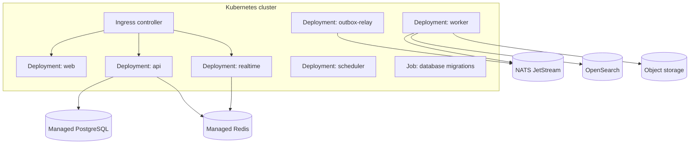

# Infrastructure And Risk

Last updated: 2026-05-15

Status: Proposed Phase 1 baseline

Back to [System Architecture](README.md).

## Kubernetes And Deployment Topology

### Deployment Units

### Infrastructure Strategy

- Use Terraform for cloud infrastructure.
- Use Helm charts or Kustomize for Kubernetes manifests.
- Use GitHub Actions for CI, tests, image build, security checks, and deployment.
- Use separate environments for local, preview, staging, and production.
- Use managed PostgreSQL, Redis, object storage, and OpenSearch where possible.
- Run NATS JetStream managed or as an operator-backed cluster only if the team can operate it safely.

### Kubernetes Baseline

Required controls:

- Resource requests and limits for every deployment.
- Horizontal Pod Autoscaling for web, API, worker, and realtime.
- Pod Disruption Budgets for API, realtime, workers, and event transport.
- Readiness and liveness probes.
- Network policies between app namespaces and data systems.
- Service accounts with least privilege.
- External Secrets integration.
- Ingress TLS termination and WAF or edge protection.
- Separate migration job with rollback-aware release process.

### Progressive Delivery

Use feature flags and kill switches for:

- Realtime fanout.
- Search indexing.
- GitHub webhook processing.
- Import workers.
- AI workflows.
- AI provider calls.
- Notification email delivery beyond invites.

Deployment flow:

1. Build and test every package.
2. Run unit, integration, tenant isolation, and permission matrix tests.
3. Run database migration dry-run in staging.
4. Deploy to staging.
5. Run smoke and E2E tests.
6. Deploy production with canary or rolling strategy.
7. Monitor SLO, error, event lag, and DLQ dashboards.
8. Roll back application or disable feature flag when needed.

### Disaster Recovery Baseline

Phase 1 does not need active-active multi-region. It does need recoverability.

| System         | RPO                            | RTO                                                    |
| -------------- | ------------------------------ | ------------------------------------------------------ |
| PostgreSQL     | 15 minutes or better           | 4 hours for MVP beta                                   |
| Object storage | 1 hour or better               | 4 hours                                                |
| Search index   | Rebuildable                    | 8 hours acceptable if core product degrades gracefully |
| Vector store   | Rebuildable                    | 8 hours acceptable if AI search degrades gracefully    |
| Event bus      | Best effort plus outbox replay | 2 hours for async recovery                             |

## Scalability And Risk Analysis

| Risk                          | Why It Matters                                                | Mitigation                                                                                                 |
| ----------------------------- | ------------------------------------------------------------- | ---------------------------------------------------------------------------------------------------------- |
| Hot tenant database load      | A large workspace can dominate shared tables                  | Composite tenant indexes, query budgets, pagination, per-tenant rate limits, future tenant sharding path   |
| Board and list query growth   | Issue views can become slow with filters and sorts            | Query plans, cursor pagination, materialized read models when needed, default active lifecycle filters     |
| Search permission leakage     | Search can reveal hidden work                                 | Mandatory permission filters, removed-member tests, permission cache invalidation, no hidden count leakage |
| Vector retrieval leakage      | AI can leak more subtly than search                           | Same effective permission model as search, source references, prompt payload tests, retrieval audit logs   |
| WebSocket fanout storms       | Board moves, imports, or membership changes can create bursts | Refetch signals for large updates, Redis adapter, per-channel rate limits, backpressure metrics            |
| Event consumer lag            | Search, notifications, and AI can fall behind                 | Consumer lag dashboards, autoscaling workers, DLQs, replay paths                                           |
| Retry storms                  | Provider or database outage can amplify load                  | Exponential backoff with jitter, circuit breakers, bounded retries, DLQs                                   |
| Import duplication            | Failed imports can create duplicate issues                    | Source external IDs, idempotency keys, staging records, retry tests                                        |
| GitHub webhook bursts         | GitHub can deliver many events quickly                        | Signature verification first, queue processing, idempotency, workspace/project scope checks                |
| AI provider latency or outage | AI workflows can block perceived value                        | Async jobs, timeout policy, manual fallback, provider kill switch, model gateway abstraction               |
| AI hallucinations             | Incorrect summaries create review work                        | Source-backed outputs, no-answer behavior, evaluation fixtures, acceptance and correction metrics          |
| Notification noise            | Users ignore important signals                                | Start with high-signal notifications, preference foundation, delivery metrics                              |
| Distributed monolith drift    | Future services can remain tightly coupled                    | Module ownership, public contracts, event schemas, extraction readiness reviews                            |
| Audit write failures          | Governance trust breaks                                       | Audit write monitoring, retry or fail-closed policy for sensitive actions                                  |
| Secrets exposure              | Integration and AI credentials are sensitive                  | Secret manager, log scrubbing, event payload restrictions, security tests                                  |
